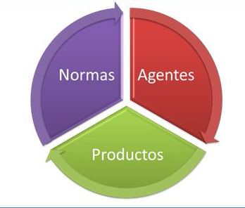

---
title       : La Estadística Oficial
subtitle    : Tratamiento de Datos
author      : Benito José Velasco de Abreu Alves
job         : Instituto Nacional de Estadística
framework   : io2012        # {io2012, html5slides, shower, dzslides, ...}
highlighter : highlight.js  # {highlight.js, prettify, highlight}
hitheme     : tomorrow      # 
widgets     : [mathjax, quiz, bootstrap,interactive]            # {mathjax, quiz, bootstrap}
ext_widgets : {rCharts: [libraries/nvd3, libraries/leaflet, libraries/dygraphs]}
mode        : selfcontained # {standalone, draft}
knit        : slidify::knit2slides
logo        : Logo1.png
biglogo     : Logo1.png
assets      : {assets: ../../assets}
--- .class #id

<style type="text/css">
body {background:grey transparent;
}
</style>

## Objetivos      

<br>  
    
1. Analizar los Sistemas Estadísticos Estatal y Europeo    
  
2. Obtener datos en el Portal Web del INE    

3. Tratar los datos con el programa estadístico R    


--- .segue bg:grey

# 1. El Sistema Estadístico Estatal

--- .class #id

##  
El Sistema Estadístico  Estatal es el encargado de elaborar las estadísticas oficiales del Estado Español, así como de las estadísticas oficiales del Sistema Estadístico Europeo.  


 <iframe width="400" height="225" frameborder="0"
  src="http://www.ine.es/explica/explica_estad_oficiales_ine_sen.htm" >
</iframe>

--- .class #id 

## Antecedentes históricos
<br>
<br>
1856: Comisión Estadística del Reino   
1945: Ley de Estadística → Instituto Nacional de Estadística   
1964: Primer ordenador en el INE    
1989: Ley de la Función Estadística Pública (LFEP)


--- .class #id

## Justificación de la Estadística Oficial y su regulación

<br>

- Herramienta básica para la toma de decisiones del Estado.

- Necesidades crecientes de información.

- Avances en las TIC.  

- Relaciones en materia estadística con las CCAA y la UE.  

--- .class #id

## Estructura del Sistema Estadístico Estatal

### Se define atendiendo a tres pilares fundamentales:

1. Las normas que rigen el funcionamiento del sistema  

2. Los agentes participantes  

3. Las estadísticas que se elaboran en dicho sistema  

 


--- .class #id

## 1. Las normas que rigen el Sistema

* Constitución Española: "el Estado tiene competencia exclusiva sobre las estadísticas para fines estatales"

+ Ley de la Función Estadística Pública (LFEP), de 9 de mayo de 1989, regula la actividad estadística estatal. Establece:
  
+ Quiénes son los agentes participantes en el sistema, sus funciones, competencias, actuación y relaciones.

+ La planificación estadística. 

+ Los principos de la recogida de datos: 1. *Secreto estadístico*. 2. *Transparencia*. 3. *Especialidad*. 4. *Proporcionalidad*.

--- .class #id

## 2. Los agentes participantes

+ Atendiendo a una clasificación primaria de los grupos de interés, los agentes participantes en el Sistema Estadístico Estatal se pueden dividir en tres grandes grupos: **productores, informantes y usuarios**.  

+ De este modo, la LFEP insta a los servicios estadísticos de la Administración del Estado a producir las estadísticas para fines estatales que demandan los usuarios utilizando los datos que les proporcionan los informantes.

--- .class #id

## Relaciones entre los agentes  
+ Los **usuarios** demandan estadísticas de calidad, al menor coste, de amplia y puntual difusión en un formato accesible.  

+ Los **informantes** seleccionados tienen la *obligación de proporcionar la información* que se les solicite.  

+ Los **productores** han de elaborar sus estadísticas con independencia, la mayor calidad posible, garantizando el secreto estadístico de los informantes y optimizando la utilización de sus recursos, minimizando la carga de respuesta de los informantes y de forma que se puedan compartir y reutilizar las herramientas empleadas en el proceso estadístico.


--- .class #id

## Los usuarios

+ Las Instituciones Públicas, ya sean administraciones públicas españolas (estatales, autonómicas o locales), la Unión Europea o bien otros organismos internacionales (Naciones Unidas, FMI, OCDE, …)  

+ Resto de usuarios: organizaciones empresariales o sindicatos, los investigadores (universitarios o servicios de estudios privados), los analistas y medios especializados y la sociedad en general.

--- .class #id

## Los informantes

+ Las **personas físicas**, que constituyen la fuente principal de las encuestas a hogares (encuestas demográficas, sociales y algunas económicas).  

+ Las **personas jurídicas privadas**, fuente principal de las encuestas a empresas.  

+ La **administración pública**, que dispone de numerosos registros administrativos, que constituyen la base principal de una gran mayoría de estadísticas y sirven de apoyo a otras tantas operaciones.  

--- .class #id

## Los productores

Según la LFEP, los agentes que desarrollan la función estadística pública en el ámbito de la Administración del Estado son:  


1. El **Instituto Nacional de Estadística** (INE)  

2. Los servicios estadísticos de los **departamentos ministeriales** y de otras entidades públicas  

3. El **Consejo Superior de Estadística** (CSE)  

4. La **Comisión Interministerial de Estadística** (CIE)  

5. El **Comité Interterritorial de Estadística** (CITE)  


--- .class #id

## El Instituto Nacional de Estadística (INE)

*El INE en la sociedad*
<iframe width="400" height="225" frameborder="0"
  src="http://www.ine.es/explica/explica_estad_oficiales_ine_inesociedad.htm" >
</iframe>

--- .class #id 

## El Instituto Nacional de Estadística (INE) (Cont..)

+ El Instituto Nacional de Estadística (INE) es el organismo central de Estadística en España.  

+ Es un Organismo Autónomo, adscrito al Ministerio de Economía y Competitividad, y goza de la capacidad funcional necesaria para garantizar su neutralidad operativa.  

+ Cuenta con alrededor de 4.000 empleados, de los cuales unos 700 pertenecen a los Cuerpos Estadísticos del Estado, distribuidos en tre los SSCC y las 52 Delegaciones Provinciales.

--- .class #id

## El Instituto Nacional de Estadística (INE) (Cont..)

Sus funciones principales son:  

+ La coordinación de los servicios estadísticos de la AGE  

+ La realización de las principales operaciones estadísticas  

+ La formación del Directorio Central de Empresas (DIRCE)  

+ La formación del Censo Electoral y del Padrón Contínuo  

+ La difusión de resultados y metodologías de las estadísticas oficiales  

+ Las relaciones internacionales en materia estadística


--- .class #id


## Los otros servicios de estadística
<br>
+ Departamentos de estadística de los Ministerios  

+ Banco de España  

+ Consejo General del Poder Judicial

--- .class #id

## El Consejo Superior de Estadística (CSE)

+ Es el máximo órgano consultivo de la estadística pública y de participación social de los productores, informantes y usuarios de las estadísticas para fines estatales. Su Presidente es el Ministro de Economía y Competitividad.  

+ Funciones:

+ Dictamina los proyectos de estadísticas para fines estatales, así como el anteproyecto del Plan Estadístico Nacional.   

+ Aprueba la Memoria anual de su actividad y es informado de las memorias del resto de agentes públicos (INE, otros servicios, CIME, CITE)

--- .class #id
 
## La Comisión Interministerial de Estadística (CIME)

+ Es un órgano de participación de los servicios estadísticos de la Administración del Estado. Presidida por el Presidente del Instituto Nacional de Estadística   

 Objetivos principales:  

+ Fomentar la coordinación y fortalecer la cooperación entre ellos.  

+ Integrar los sistemas de información estadística, homogeneizando y normalizando los aspectos conceptuales y metodológicos.  

+ Promover el mantenimiento de registros y directorios de unidades estadísticas, como marco para la realización de encuestas.  

--- .class #id

## El Comité Interterritorial de Estadística (CITE)

+ Es el Órgano colegiado encargado de velar por la coordinación, la cooperación y la homogeneización en materia estadística entre el Estado y las Comunidades Autónomas.  

+ Los servicios estadísticos de la Administración del Estado conviven con las Oficinas Centrales de Estadística de las Comunidades Autónomas (OCECA), que pueden elaborar estadísticas para fines autonómicos.  

+ Pero los indicadores nacionales y regionales de España que se manejan como cifras oficiales a nivel internacional provienen de los resultados obtenidos por el Sistema Estadístico Estatal.


Funciones:

Promover la explotación conjunta de fuentes administrativas.
Propiciar intercambios para completar y mejorar directorios y registros, para la coordinación de sus sistemas integrados de información estadística, y para la formación del inventario de las estadísticas disponibles.
Potenciar el intercambio de experiencias metodológicas en materia estadística, incluyendo los procedimientos de recogida y tratamiento de datos y llevar a cabo el seguimiento periódico de los convenios de cooperación en materia estadística que se hayan establecido.

--- .class #id
## El Plan Estadístico Nacional (PEN)

+ Principal instrumento ordenador de la actividad estadística de la AGE. Se aprueba mediante Real Decreto.  


+ Formulado por el INE junto con los demás servicios estadísticos estatales, en su tramitación intervienen CSE, CIME y CITE.

+ Contiene las estadísticas que los servicios estadísticos estatales se comprometen a elaborar durante el cuatrienio de vigencia del Plan. 

+ Las estadísticas del PEN son de cumplimentación obligatoria y sus resultados tienen carácter oficial.

--- .class #id

## Los Programas Anuales de Desarrollo (PA)

+ Para cada Plan Estadístico Nacional se formulan cuatro Programas Anuales que contienen los trabajos concretos que han de realizarse en dicho año con el fin de ejecutar el PEN. Se aprueban mediante Real Decreto.  

+ Sirven también como herramientas de actualización del PEN con los que incorporar estadísticas no incluidas inicialmente en él o se eliminan las que han dejado de realizarse. Asimismo, se pueden modificar las estimaciones de costes a incorporar en los Presupuestos Generales del Estado.

--- .class #id

## El Inventario de Operaciones Estadísticas (IOE)

+ Es un repertorio de las operaciones estadísticas realizadas por el Instituto Nacional de Estadística, los Departamentos Ministeriales, el Banco de España y el Consejo General del Poder Judicial.

+ Constituye una herramienta fundamental de coordinación y planificación estadística y sirve de base para la formulación del PEN.

+ El INE es el responsable de elaborar, mantener y actualizar el IOE.   

+ El IOE es accesible al público a través de la página web del INE y en él se puede consultar la ficha de cada una de las operaciones inventariadas, o bien obtener la relación de operaciones según diferentes criterios.

--- .segue bg:grey

# Tests

--- &radio

## Radio

¿Quién aprueba el Plan Estadístico Nacional (PEN)?


1. El Instituto Nacional de Estadística (INE)
2. El Consejo Superior de Estadística (CSE)
3. El Comité Interministerial de Estadística (CIME)
4. El Comité Interterritorial de Estadística (CITE)
5. _El Consejo de Ministros_


*** .explanation

La  ley  12/1989,  de  9  de  mayo,  de  la  Función  Estadística  Pública,  establece,  en  su 
artículo  8 que El Plan Estadístico Nacional `será aprobado por Real Decreto` y tendrá una vigencia de cuatro años. Por tanto, es aprobado por el **Consejo de Ministros**.

No obstante lo anterior, la ley establece que,  previamente a su aprobación, el PEN ha de ser dictaminado por el CSE e informado por el CIME y el CITE.

*** .hint

El Plan Estadístico Nacional es el principal instrumento ordenador de la actividad Estadística de la Administración General del Estado y tiene una vigencia de cuatro años.

--- &radio2

## Radio (Dos columnas) 

¿Cuál de estos dos diagramas de dispersión tiene mayor correlación?


1. A
2. B

*** =image


*** .explanation

Ambos tienen la misma correlación.

---  &checkbox

## Checkbox

Linda tiene 31 años de edad, soltera, inteligente y muy brillante. Se especializó en filosofía. Como estudiante, estaba profundamente preocupada por los problemas de discriminación y justicia social, participando también en manifestaciones anti-nucleares.

¿Que es más probable?

1. _1. Linda es una cajera de banco._
2. 2. Linda es una cajera de banco y es activista de movimientos feministas.


*** .hint

Piensa en las probabilidades de cada suceso y en las de ambos conjuntamente.

*** .explanation

 La respuesta correcta es la 1.
 
 La probabilidad de que dos eventos ocurran juntos (en "conjunción") es siempre menor o igual que la probabilidad de que cada uno ocurra por separado. Formalmente, para dos sucesos A (cajera) y B (activista), esta desigualdad podría escribirse como:


    P(A) >= P(A ∩ B) <= P(B)

 En un estudio realizado por Tversky y Kahneman, el 85% de los encuestados eligió, sin embargo, la opción 2. Los autores argumentan que la mayoría de las personas tienen este tipo de problemas porque usan la `representatividad heurística` para hacer estos juicios: La opción 2 es la más "representativa", basada en la descripción de Linda, pero matemáticamente es menos probable.
 
 Esto se denomina [Falacia de la Conjunción] (https://es.wikipedia.org/wiki/Falacia_de_la_conjunci%C3%B3n), que sucede cuando se asume que condiciones específicas son más probables que una general sencilla. 

--- .segue bg:grey


# 2. El Sistema Estadístico Europeo (SEE)


--- .class #id

## 2. El Sistema Estadístico Europeo (SEE)


<iframe width="400" height="225" frameborder="0"
  src="http://www.ine.es/explica/explica_estad_oficiales_ine_see.htm" >
</iframe>

--- .segue bg:grey


# 3. Los datos del Instituto Nacional de Estadística

--- .class #id

## 3. El Instituto Nacional de Estadística (INE) (Cont..)
Las Estadísticas del INE

[Cómo se realizan las Estadísticas] (https://www.youtube.com/watch?v=_SO0kv3rk2o&list=PLJulBV7cVXicGdSJoFKvjS0hWfSLycMmh)

[Índice de Precios de Consumo (IPC)] (https://www.youtube.com/watch?v=qKs-mNOMBeE&list=PLJulBV7cVXicGdSJoFKvjS0hWfSLycMmh)

[Muestras y marcos estadísticos] (https://www.youtube.com/watch?v=W0LJSCOoyt4&list=PLJulBV7cVXidU_cleHYJ9jNjfrByO9xqi) 


--- .class #id 
## 3. El Instituto Nacional de Estadística (INE) (Cont..)
####  La página web del INE (www.ine.es)


Además, la Ley insta a los servicios estadísticos estatales a utilizar el mismo sistema normalizado de conceptos, definiciones, unidades estadísticas, clasificaciones, nomenclaturas y códigos, de manera que sea posible comparar, integrar y analizar la información primaria y los resultados finales.

---  &multitext


 


--- .class #id


--- .class #id 


- Ejemplo:

```{r, fig.height = 4.5, fig.width = 8, fig.align = 'center', message=FALSE}
plot(cars)
abline(lm(dist ~ speed, data = cars), col = "red")
```


--- .class #id 

## 7. La página web del INE (cont)

- Here is a more complex example

```{r, fig.height = 4, fig.width = 10, fig.align = 'center', message=FALSE,warning= FALSE, cache=FALSE}
library(ggplot2)
g <- ggplot(cars, aes(speed, dist))
g + geom_point() +
	geom_smooth()
```

