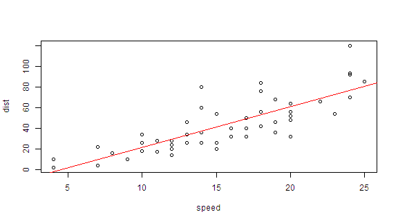
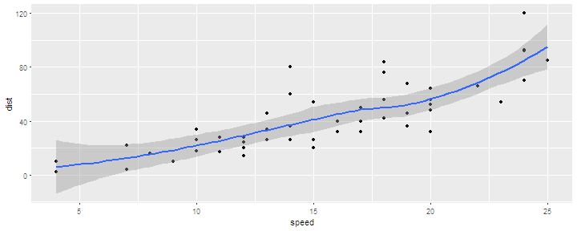

---
title       : La Estadística Oficial
subtitle    : Tratamiento de Datos
author      : Benito José Velasco de Abreu Alves
job         : Instituto Nacional de Estadística
framework   : io2012        # {io2012, html5slides, shower, dzslides, ...}
highlighter : highlight.js  # {highlight.js, prettify, highlight}
hitheme     : tomorrow      # 
widgets     : [mathjax, quiz, bootstrap,interactive]            # {mathjax, quiz, bootstrap}
ext_widgets : {rCharts: [libraries/nvd3, libraries/leaflet, libraries/dygraphs]}
mode        : selfcontained # {standalone, draft}
knit        : slidify::knit2slides
logo        : Logo1.png
biglogo     : Logo1.png
assets      : {assets: ../../assets}
--- .class #id

<style type="text/css">
body {background:grey transparent;
}
</style>

## Objetivos      

<br>  
    
### 1. Analizar los Sistemas Estadísticos Nacional y Europeo    
  
### 2. Obtener datos en el Portal Web del INE    

### 3. Tratar los datos con el programa estadístico R    


--- .segue bg:grey

# 1. Los Sistemas Estadísticos Nacional y Europeo...

--- .class #id


  1. La Ley de la Función Estadística Pública 

  2. Estructura del Sistema Nacional de Estadística de España
    - Agentes encargados de la producción de estadísticas estatales
        - El Instituto Nacional de Estadística
        - Otros servicios de estadística
        - Órganos Colegiados:
          * El Consejo Superior de Estadística (CSE)
          * La Comisión Interministerial de Estadística (CIE)
          * El Comité Interterritorial de Estadística (CITE)
         
  3. Planificación y producción estadística 
      * Plan Estadístico Nacional (PEN)
      * Programas anuales desarrollo (PA)
      * El Inventario de Operaciones Estadísticas (IOE) 

--- .class #id
Trato de escribir párrafos diferentes  
A ver qué obtengo    

de este modo  
Debería ver tres párrafos


--- .class #id
## 1. El Sistema Estadístico Nacional (SEN)

 <iframe width="400" height="225" frameborder="0"
  src="http://www.ine.es/explica/explica_estad_oficiales_ine_sen.htm" >
</iframe>
 
 

--- .class #id 

## 2. El Sistema Estadístico Europeo (SEE)


<iframe width="400" height="225" frameborder="0"
  src="http://www.ine.es/explica/explica_estad_oficiales_ine_see.htm" >
</iframe>


--- .class #id 

## 3. El Instituto Nacional de Estadística (INE)

*El INE en la sociedad*
<iframe width="400" height="225" frameborder="0"
  src="http://www.ine.es/explica/explica_estad_oficiales_ine_inesociedad.htm" >
</iframe>

--- .class #id 

## 3. El Instituto Nacional de Estadística (INE) (Cont..)

 *La actividad del INE*
<iframe width="400" height="225" frameborder="0"
  src="http://www.ine.es/explica/explica_estad_oficiales_ine_queesine.htm" >
</iframe>


--- .class #id


## 3. El Instituto Nacional de Estadística (INE) (Cont..)
[El Sistema de gestión de la calidad del INE](http://www.ine.es/explica/explica_estad_oficiales_ine_calidad.htm) 


[Unidad y Comité de Calidad]
(http://www.ine.es/ss/Satellite?c=Page&cid=1259943453875&pagename=MetodologiaYEstandares%2FINELayout&L=0)

[Informes e indicadores de calidad] (http://www.ine.es/ss/Satellite?c=Page&cid=1259944129082&pagename=MetodologiaYEstandares%2FINELayout&L=0)

[Encuestas a usuarios] (http://www.ine.es/ss/Satellite?c=Page&cid=1259944133654&pagename=MetodologiaYEstandares%2FINELayout&L=0)

[Evaluación externa Peer Review] (http://www.ine.es/ss/Satellite?c=Page&cid=1259944133702&pagename=MetodologiaYEstandares%2FINELayout&L=0)
 
Conferencia Europea de Calidad en la Estadística Oficial

Politica de difusión. Distribución de resultados estadísticos bajo embargo  

Política de confidencialidad

Política de revisión  

[Carta de servicios] (http://www.ine.es/prodyser/carta_servicios_triptico.pdf)

Evaluación y seguimiento de la calidad en la Administración Pública Española  


--- .class #id


## 3. El Instituto Nacional de Estadística (INE) (Cont..)
Las Estadísticas del INE

[Cómo se realizan las Estadísticas] (https://www.youtube.com/watch?v=_SO0kv3rk2o&list=PLJulBV7cVXicGdSJoFKvjS0hWfSLycMmh)

[Índice de Precios de Consumo (IPC)] (https://www.youtube.com/watch?v=qKs-mNOMBeE&list=PLJulBV7cVXicGdSJoFKvjS0hWfSLycMmh)

[Muestras y marcos estadísticos] (https://www.youtube.com/watch?v=W0LJSCOoyt4&list=PLJulBV7cVXidU_cleHYJ9jNjfrByO9xqi) 

[Pirámides de población] (https://www.youtube.com/watch?v=5LHt-C-OZTE&list=PLJulBV7cVXidU_cleHYJ9jNjfrByO9xqi) 

[Esperanza de vida] (https://www.youtube.com/watch?v=442OaTeA60g&list=PLJulBV7cVXidU_cleHYJ9jNjfrByO9xqi)

[Brecha de género]
(https://www.youtube.com/watch?v=_T6tLDGRgJM&list=PLJulBV7cVXidU_cleHYJ9jNjfrByO9xqi)


--- .class #id 
## 3. El Instituto Nacional de Estadística (INE) (Cont..)
####  La página web del INE (www.ine.es)

- Ejemplo:


```r
plot(cars)
abline(lm(dist ~ speed, data = cars), col = "red")
```




--- .class #id 

## 7. La página web del INE (cont)

- Here is a more complex example


```r
library(ggplot2)
g <- ggplot(cars, aes(speed, dist))
g + geom_point() +
	geom_smooth()
```



--- .segue bg:grey

# Tests

--- &radio

## Radio

¿Quién aprueba el Plan Estadístico Nacional (PEN)?


1. El Instituto Nacional de Estadística (INE)
2. El Consejo Superior de Estadística (CSE)
3. El Comité Interministerial de Estadística (CIME)
4. El Comité Interterritorial de Estadística (CITE)
5. _El Consejo de Ministros_


*** .explanation

La  ley  12/1989,  de  9  de  mayo,  de  la  Función  Estadística  Pública,  establece,  en  su 
artículo  8 que El Plan Estadístico Nacional `será aprobado por Real Decreto` y tendrá una vigencia de cuatro años. Por tanto, es aprobado por el **Consejo de Ministros**.

No obstante lo anterior, la ley establece que,  previamente a su aprobación, el PEN ha de ser dictaminado por el CSE e informado por el CIME y el CITE.

*** .hint

El Plan Estadístico Nacional es el principal instrumento ordenador de la actividad Estadística de la Administración General del Estado y tiene una vigencia de cuatro años.

--- &radio2

## Radio (Dos columnas) 

¿Cuál de estos dos diagramas de dispersión tiene mayor correlación?


1. A
2. B

*** =image


*** .explanation

Ambos tienen la misma correlación.

---  &checkbox

## Checkbox

Linda tiene 31 años de edad, soltera, inteligente y muy brillante. Se especializó en filosofía. Como estudiante, estaba profundamente preocupada por los problemas de discriminación y justicia social, participando también en manifestaciones anti-nucleares.

¿Que es más probable?

1. _1. Linda es una cajera de banco._
2. 2. Linda es una cajera de banco y es activista de movimientos feministas.


*** .hint

Piensa en las probabilidades de cada suceso y en las de ambos conjuntamente.

*** .explanation

 La respuesta correcta es la 1.
 
 La probabilidad de que dos eventos ocurran juntos (en "conjunción") es siempre menor o igual que la probabilidad de que cada uno ocurra por separado. Formalmente, para dos sucesos A (cajera) y B (activista), esta desigualdad podría escribirse como:


    P(A) >= P(A ∩ B) <= P(B)

 En un estudio realizado por Tversky y Kahneman, el 85% de los encuestados eligió, sin embargo, la opción 2. Los autores argumentan que la mayoría de las personas tienen este tipo de problemas porque usan la `representatividad heurística` para hacer estos juicios: La opción 2 es la más "representativa", basada en la descripción de Linda, pero matemáticamente es menos probable.
 
 Esto se denomina [Falacia de la Conjunción] (https://es.wikipedia.org/wiki/Falacia_de_la_conjunci%C3%B3n), que sucede cuando se asume que condiciones específicas son más probables que una general sencilla. 


---  &multitext
